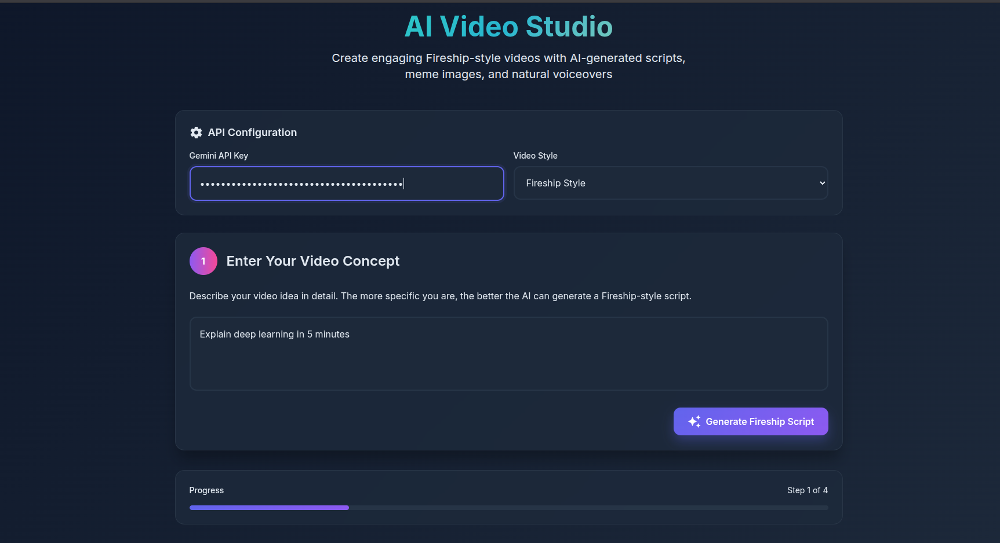
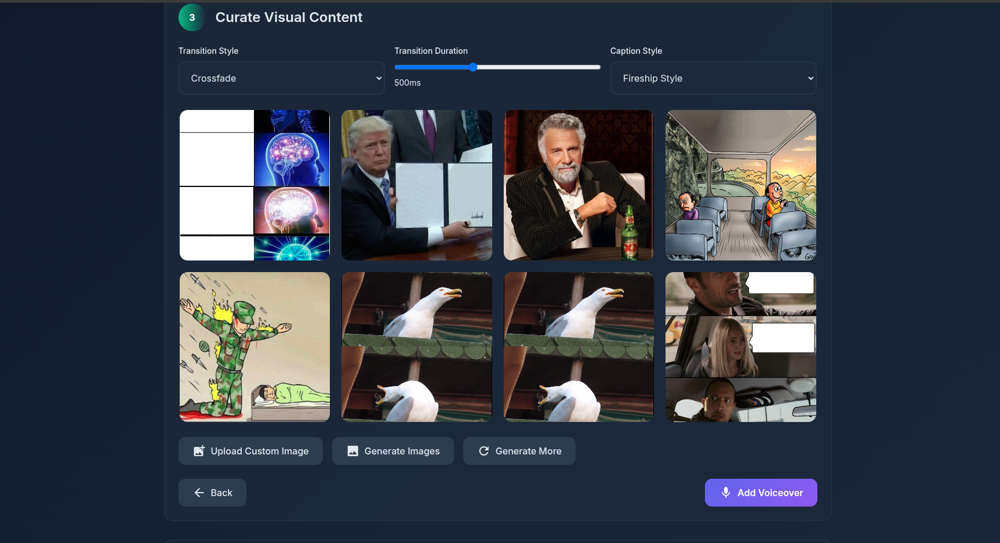
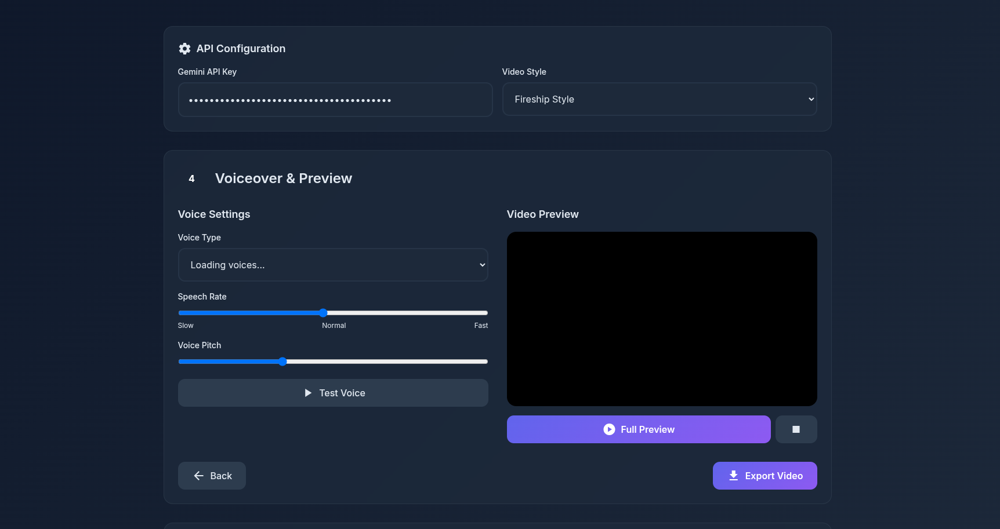
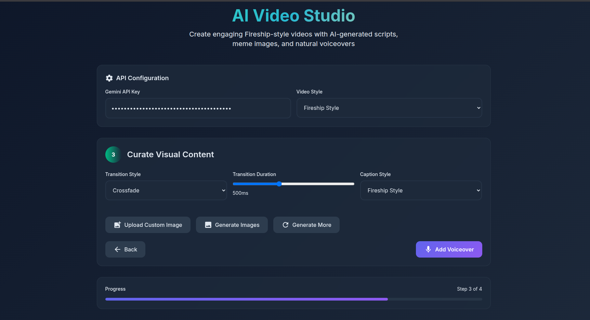
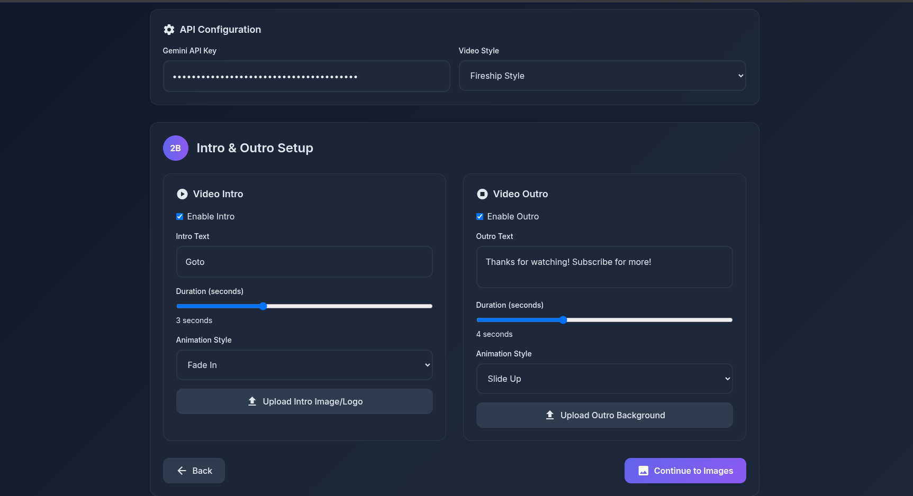

# 🎬 GlitchFlick

> **Turn any idea into a slick, creator-style video in minutes — with memes, AI voice, and zero editing.**

[](https://youtu.be/oepi8DPtczo?si=EoKDJkoD2-T-b-kg)

[🌐 Live Demo](https://v0-new-project-zo48m0ejyw0.vercel.app/) | [📂 GitHub Repo](https://github.com/1mystic/GlitchFlick)

---

## ✨ What is GlitchFlick?

**GlitchFlick** is an AI-powered web app that takes your video idea and instantly transforms it into an engaging, fully-edited video — complete with:

- 🧠 **AI-Generated Scripts** (via Gemini)
- 🖼️ **Auto-curated meme visuals**
- 🎙️ **Natural-sounding voiceovers**
- 🎞️ **Video previews & export options**
- ✅ **No editing skills required**

Built for creators, educators, marketers, and anyone who wants to turn *thoughts into videos* — fast.

---

## 🖼️ UI Preview

| Home Screen | Script Generation | Image Curation | Voiceover Settings |
|-------------|-------------------|----------------|---------------------|
|  |  |  |  |

| Config Panel | Setup Prompt | Final Export / Update |
|--------------|--------------|------------------------|
|  |  |  |

---

## ⚙️ Features

- 🎯 **Prompt-to-Video Flow**: Write a prompt, and GlitchFlick handles the rest.
- ✍️ **Fireship-Style Script Generator**: Gemini API with scene formatting.
- 🖼️ **Meme Image Integration**: Uses Imgflip + Reddit for visuals.
- 🗣️ **Voice Customization**: Adjust pitch, speed, and voice type.
- 📦 **Export as WebM or MP4** *(server-side or FFmpeg planned)*.
- 💾 **Autosave with LocalStorage**.
- 🖥️ **Fully responsive UI** built with TailwindCSS.

---

## 🧰 Built With

- **Google Gemini API (via AI Studio)** – script & scene generation  
- **ResponsiveVoice / Web Speech API** – voice synthesis  
- **Imgflip API + Reddit Meme API** – for visual content  
- **TailwindCSS** – UI styling  
- **Vanilla JavaScript** – logic and flow  
- **FFmpeg.js (planned)** – in-browser video compilation  
- **HTML5 Canvas** – export previews

---

## 🚀 Getting Started

```bash
# Clone the repo
git clone https://github.com/1mystic/GlitchFlick.git
cd GlitchFlick

# Open in browser (or serve locally)
open prompt2vid.html
# or
npx serve .
```
⚠️ Don’t forget to add your Gemini API key and (optional) ResponsiveVoice API key in the UI.

---

## 📂 Folder Structure

```bash
Copy
Edit
GlitchFlick/
├── snips/                # Screenshots used in README
│   ├── config.png
│   ├── home.png
│   ├── image.png
│   ├── index.html.png
│   ├── script.png
│   ├── setup.png
│   ├── update.html.png
│   └── voice.png
├── prompt2vid.html       # Main HTML file
├── README.md             # You're here!
```
---

## 🤝 Contribution

Feel free to fork and improve! Bug fixes, style upgrades, voice/video enhancements, and backend export logic are welcome.

Fork the repo

Create a feature branch

Commit your changes

Submit a pull request

## 📜 License

No License — use freely, build wildly, credit kindly.

## ✉️ Contact
Built with ❤️ by @1mystic
For inquiries, suggestions, or startup interest, reach out at: atharvkhare18@gmail.com

